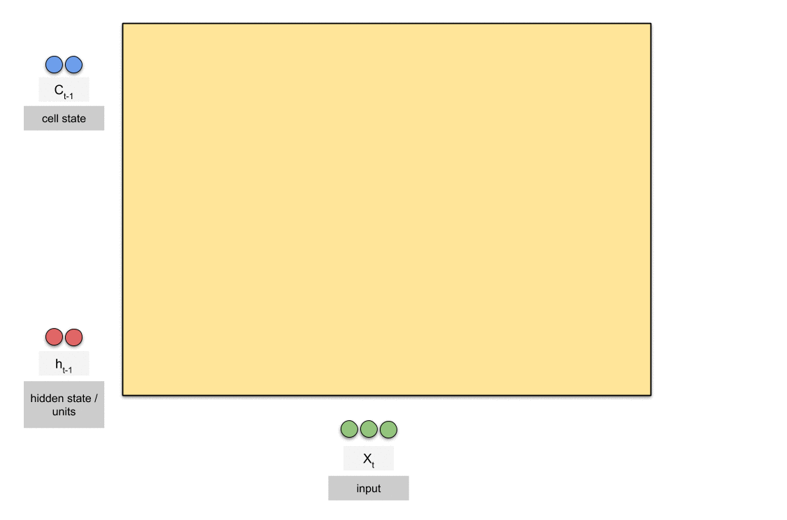
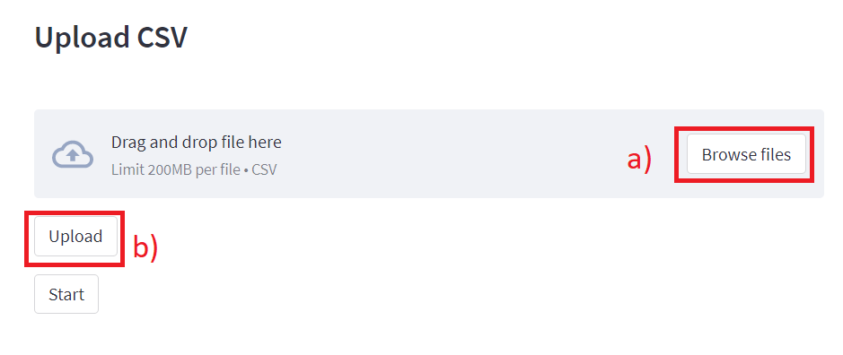
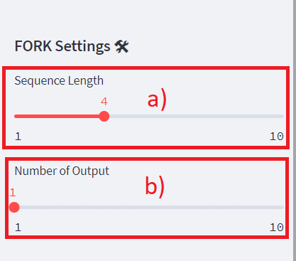
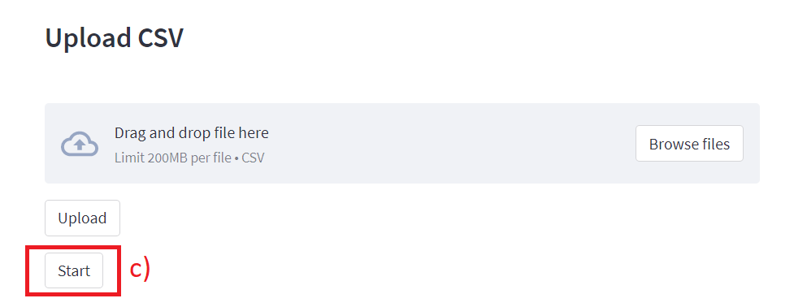
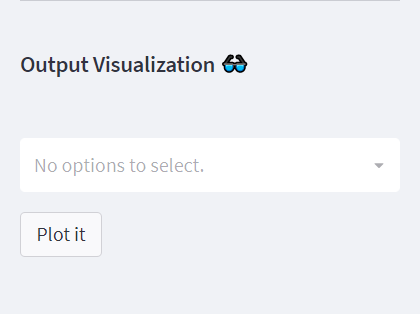

# Analytic-Fork 📈🍴

Imagine a transformative analytical powerhouse that was originally sculpted to decode the intricate dance of energy and water consumption within manufacturing juggernauts and akin enterprises, right down to every manufacturing echelon. Behold the birth of Analytic FORK – a tool that not only scrutinizes these vital metrics with unprecedented acumen but also wields the power to prophesy their future incarnations. Yet, this is just the prologue to its saga. Through meticulous reengineering, FORK's potential has been unshackled, empowering it to ingest and unravel a myriad of datasets, no longer bound by domain or origin. Whether it's deciphering the heartbeat of manufacturing or forecasting the financial gusts, FORK stands ready. Anchored in its core lies the remarkable Long Short-Term Memory (LSTM), the beating heart of its forecasting prowess. This tool transcends mere analysis; it's a symphony of insight. Come, discover the infinite dimensions of data orchestration – a journey inspired by FORCK's captivating symphony of analytics. To unveil the mystique format, venture into the embrace of our support section. Your odyssey awaits.

## LSTM 🖥

<h1 align="Left"></h1>

Long Short-Term Memory (LSTM) is a type of recurrent neural network (RNN) architecture that addresses the limitations of traditional RNNs in handling long-range dependencies and vanishing gradient problems. LSTMs are designed to capture and retain information over extended sequences, making them particularly useful for tasks involving sequential data like natural language processing, speech recognition, and time series analysis. What sets LSTMs apart is their ability to selectively forget or remember information through a set of specialized gating mechanisms – the input gate, forget gate, and output gate. These gates control the flow of information within the LSTM unit, allowing it to store relevant information over long periods while preventing the degradation of gradient signals during training. This unique architecture has made LSTMs a cornerstone in the development of advanced machine learning models for tasks requiring an understanding of context and temporal dependencies.

## Begginer User Guid 🎈
>  Step 1 
Start with uploding the source csv as on which you wish to perform forcasting. (see sample csv)
<h1 align="Left"></h1>
>  Step 2
If you want play around with the settings like Sequence lenght and number of outputs you can do that just go to settings. There are few other settings to mess around but first get use to with these settings first.
<h1 align="Left"></h1>
<h1 align="left"></h1>
>  Step 3
When you are done setting up the fork intialize the compute process by going clicking start and after the successful complition of the process hit the plot it button to the get thoes amazing results in the graphical form.
<h1 align="left"></h1>
<h1 align="left"></h1>

## ⭐ Try Fork ⭐ :- 
